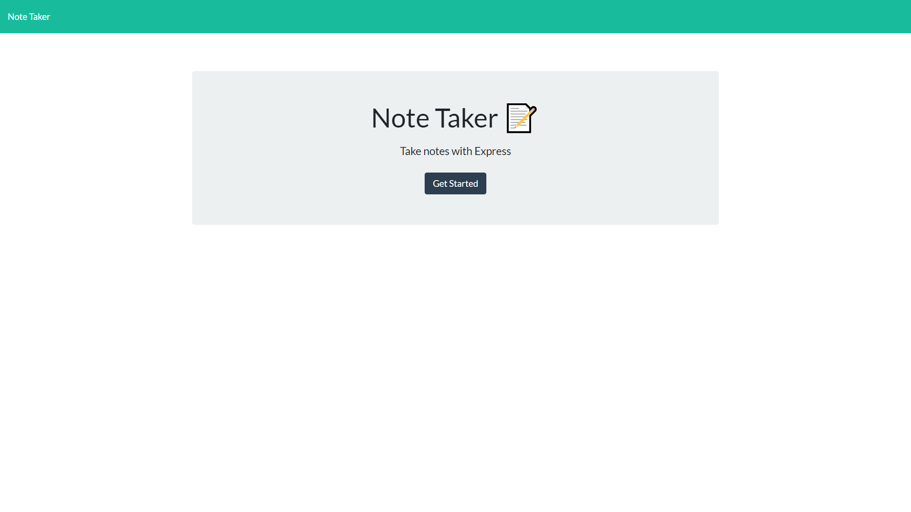
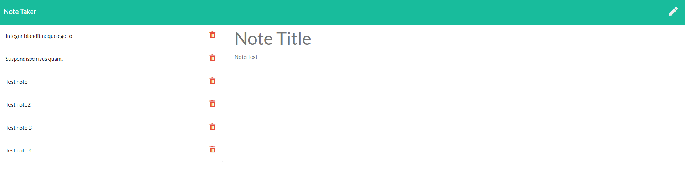
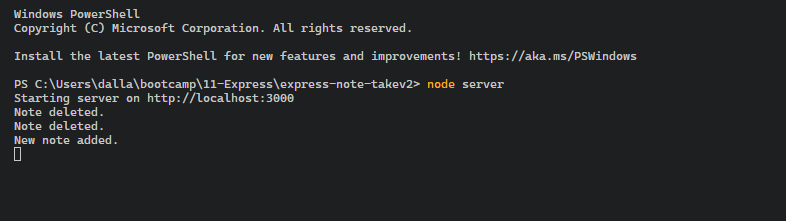
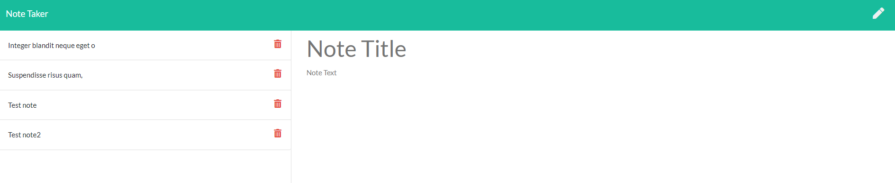
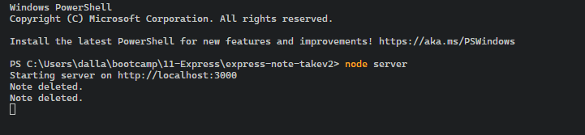

  
# Express Note Taker

  An application that can be used to write, save, and delete notes using Node and Express, utilizing JSON for data storage. With an already completed front-end, my role was to build the back-end and connect it to the front-end, as stated below:

  [](https://opensource.org/licenses/MIT)

  express-note-taker

  [A deployed version can be viewed here.](N/A)

  [The repository can be viewed here.](https://github.com/dgourley84/express-note-taker)

  ---
## Contents
1. [About](#about)
    1. [Usage](#usage)
    2. [User Story](#user-story)
    3. [Acceptance criteria](#acceptance-criteria)
    4. [Visuals](#visuals)
2. [Installation](#installation)
3. [License](#license)
4. [Contributing](#contributing)
5. [Tests](#tests)
6. [Authors and acknowledgment](#authors-and-acknowledgments)
7. [Questions](#questions)
---
## About

  An application that can be used to write, save, and delete notes using Node and Express, utilizing JSON for data storage. With an already completed front-end, my role was to build the back-end and connect it to the front-end, as stated below:

---
## Usage
  As per the visuals upon opening the file through CLI using node the user is presented with a hosted solution for a not taker.
  
  
---
## User Story
  ```
  AS A small business owner
  I WANT to be able to write and save notes
  SO THAT I can organize my thoughts and keep track of tasks I need to complete
  ```
---
## Acceptance Criteria
  ```
  GIVEN a note-taking application
  WHEN I open the Note Taker
  THEN I am presented with a landing page with a link to a notes page
  WHEN I click on the link to the notes page
  THEN I am presented with a page with existing notes listed in the left-hand column, plus empty fields to enter a new note title and the note’s text in the right-hand column
  WHEN I enter a new note title and the note’s text
  THEN a Save icon appears in the navigation at the top of the page
  WHEN I click on the Save icon
  THEN the new note I have entered is saved and appears in the left-hand column with the other existing notes
  WHEN I click on an existing note in the list in the left-hand column
  THEN that note appears in the right-hand column
  WHEN I click on the Write icon in the navigation at the top of the page
  THEN I am presented with empty fields to enter a new note title and the note’s text in the right-hand column
  ```
  
---
## Visuals:
  
  
  
  
  

---
## Installation:

  To install this application the user requires the following:

  NPM and express and uuid as dependencies.

  These should be installed using the command line prior to use.

---
## License
  License used for this project - MIT
  * For more information on license types, please reference this website
  for additional licensing information - [https: //choosealicense.com/](https://choosealicense.com/).
---

## Contributing:

  To contribute to this application, create a pull request.
  Here are the steps needed for doing that:
  - Fork the repo
  - Create a feature branch (git checkout -b NAME-HERE)
  - Commit your new feature (git commit -m 'Add some feature')
  - Push your branch (git push)
  - Create a new Pull Request
  Following a code review, your feature will be merged.

---

## Tests:

  N/A

---
## Authors & Acknowledgments

  Dallas Gourley

---

## Questions:
* GitHub Username: [dgourley84](https://github.com/dgourley84)
* GitHub Email: (dallas.gourley@yahoo.com)


